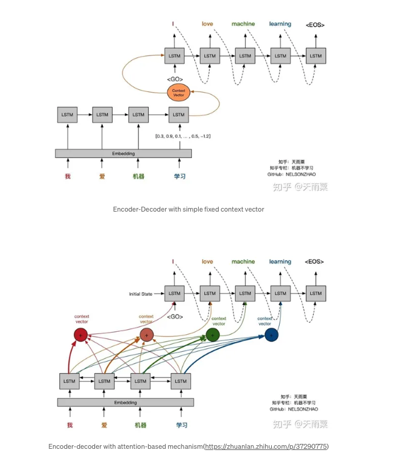
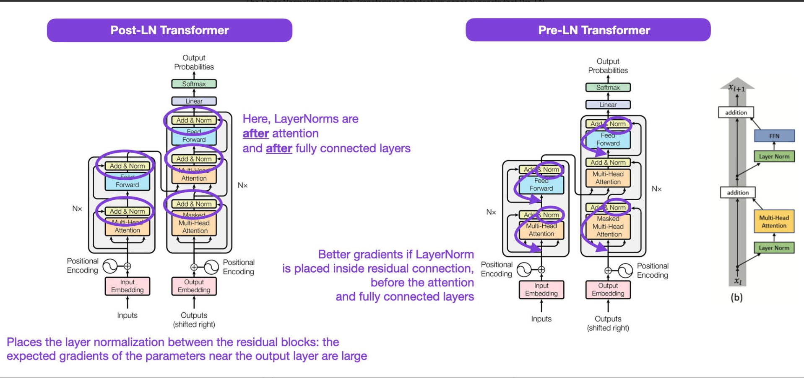

# iNeuronClass
    https://github.com/sunnysavita10/Indepth-GENAI/blob/main/Generative_AI_Roadmap.pptx
    https://www.youtube.com/@sunnysavita10/videos

(To View CMD + SHIFT +V)
    
Deep Learning
Types of NN
1. ANN:
    base network
2. CNN
3. RNN
4. GAN
5. Reinforcement Learning

Data: 
Structured Data:
    JSON
    CSV

Un-Structured Data
    Vision/CNN/Image Data/Computer Vision:
        Video Data
        Image classification:
            VGG
        Object Detection:
            Yolo
            SSD
        Object Segmentation:
            UNet
        OCR/Object Character Recognition/To recognize character inside an image:
            Amazon OCR

    Language Model/Text Data/Nature Language Processing/NLP:
        RNN for language model:
            GRU
            LSTM
            BIDI LSTM
            BIDI GRU
            Sequences:
        UseCases:
            Text Generation
            Text Summarization
            Q/A
            Language Translation
            Chatbot
        Audio Data:
            Audio first converted to text and processed using RNN

ANN:
    Input Layer
    Hidden Layer
    Output Layer

CNN:
Has many stages:
    1. Convolution (Here we process image)
        Image grid * kernel ==> We get convoluted image
        Kernel: 
            Is learnable parameter
        Multiply by kernel to extract features from the image
    2. Pooling:(Here we process image)
        maxpooling
        After maxpooling we get processed image
    3. Flattening:
        Convert 2d/3d to 1d layer after flatten
    4. Fully Connection

    Image is collection of number (0,255):
    1. black/white
    2. color (3 channel)
    Kernel is learnable parameter

RNN

Terminologies:
Weight
Bias
Activation Function
Loss functions
Optimizer
Forward and backward prop

Large Language Model:
    Processing sequence data
    1. Feedback Loop:
    2. ANN

Types of RNN (Recurrent/Repeated)
    1. Many to one
    2. One to Many
    3. Many to Many

RNN Architecture:
    output of previous state + input of current state processed at each step of the RNN to sustain the context.
    Encode words * Weights ==> pass to the next timestamp...
    Here we are processing the data in the sequence...  Single word and prev word at each step.

LSTM:
    RNN is used to process the sequence data.

Ways to map the data:
    1. One to Many:
        one input and many output
        Processing image throughtout the networks to genearate the output.
        Example: 
        Image Caption: One image and many output
            Geneate capture based on image
            Here we use both CNN and RNN.  CNN for input and RNN for output 
       
    2. Many to one
        many input and one output
        Example: 
        Text classification
            From text we are generating single output.
        Sentiment Analysis
        
    3. Many to Many
        many input and many output: Two ways to map the data
        Two type of many to many:
            
        Sychronize Input/Output:Same Length
            Refer to the same length: Same input length and Same output length
                NER/Name Entity Recognition
                POS

        Asynchronize Input/Output:Different Length
            Refer to the different length
                Machine Translation
                Text summarization

1. LSTM/Long Short Term Memory:
    Mapping of input to output
    Many to many architecture
    It maintaining long and term memory
    Maintain memory cells + hidden state are connected by different gates
    Forget Gates
    Input Gates
    Output Gates
    Here we are able to remember long and short term text.  Here we are processing the data in the sequence only.

2. GRU:
    Optimized LSTM architecture
    Here we have 2 gates:
        Reset Gate
        Updated Gate

RNN (1987)--> LSTM (1997)-->GRU(2014)

Encoder/Decoder 2014:
    Self Attention Mechanism
    Sequence to Sequence Learning
    Async input and output

Encoder/Decoder + Attention 2016

ULMFit/2018:
    Transfer learning

Transformers/2019:
    We are able to process large amount of data
    Encoder/Decoder + Attention 
    Transformer architecture, known for its effectiveness in capturing long-range dependencies in sequential data.

BERT:
    Encoder Based Architecture

GPT:
    Decoder based Architecture

Encoder/Decoder
    Seq to Seq/Sequence to Sequence Learning with Neural Networks
    https://arxiv.org/abs/1409.3215
    Single context vector is passed from encoder to decoder
    Here encode was done using LSTM cells
    context vector: different length of input and output
    Not able to process longer sequences (Not more than 30 to 35 words)
    Seq/Seq:
        Used for machine translation
        Processing data in sequence
        Context vector has complete responsibility of the encoder side.
        The idea is to use one LSTM, the encoder, to read the input sequence one timestep at a time, to obtain a large fixed dimensional vector representation (a context vector), and then to use another LSTM, the decoder, to extract the output sequence from that vector. 
        One of the main drawbacks of this network is its inability to extract strong contextual relations from long semantic sentences, that is if a particular piece of long text has some context or relations within its substrings, then a basic seq2seq model[ short form for sequence to sequence] cannot identify those contexts and therefore, somewhat decreases the performance of our model and eventually, decreasing accuracy.

Encoder/Decoder + Attention:
    
    Attention is an upgrade to the existing network of sequence to sequence models that address this limitation. The simple reason why it is called ‘attention ’ is because of its ability to obtain significance in sequences.

    First, it works by providing a more weighted or more signified context from the encoder to the decoder and a learning mechanism where the decoder can interpret were to actually give more ‘attention’ to the subsequent encoding network when predicting outputs at each time step in the output sequence.

    Thanks to attention-based models, contextual relations are being much more exploited in attention-based models, the performance of the model seems very good as compared to the basic seq2seq model, given the usage of quite high computational power.

    Created for language translator
    From encoder context vector is send to the decoder
    context vector has responsibility for everything.
    Every hidden state of the decoder is connected to EVERY hidden state of the encoder.  This is called the attention layer.  This attention layer is NN.
    One hidden state of decoder is connected to EVERY hidden state of the encoder.

SELF Attention

ULMFit
    https://arxiv.org/abs/1801.06146
    We can use transfer learning and fine tuning in NLP also. ULMFit was among the first papers to demonstrate that pretraining a language model and finetuning it on a specific task could yield state-of-the-art results in many NLP tasks.
    1. Train a language model on a large corpus of text.
    2. Finetune this pretrained language model on task-specific data, allowing it to adapt to the specific style and vocabulary of the text.
    This recipe -- training a language model on a large corpus and then finetuning it on a downstream task -- is the central approach used in transformer-based models and foundation models like BERT, GPT-2/3/4, RoBERTa, and others.

Transformer Paper:
    Attention is all you need

BERT Paper:
    https://arxiv.org/abs/1810.04805

    BERT makes use of Transformer, an attention mechanism that learns contextual relations between words (or sub-words) in a text. In its vanilla form, Transformer includes two separate mechanisms — an encoder that reads the text input and a decoder that produces a prediction for the task. Since BERT’s goal is to generate a language model, only the encoder mechanism is necessary. 

    As opposed to directional models, which read the text input sequentially (left-to-right or right-to-left), the Transformer encoder reads the entire sequence of words at once. Therefore it is considered bidirectional, though it would be more accurate to say that it’s non-directional. This characteristic allows the model to learn the context of a word based on all of its surroundings (left and right of the word).

    Masked LM (MLM)
    Before feeding word sequences into BERT, 15% of the words in each sequence are replaced with a [MASK] token. The model then attempts to predict the original value of the masked words, based on the context provided by the other, non-masked, words in the sequence. 

    Next Sentence Prediction (NSP)
        In the BERT training process, the model receives pairs of sentences as input and learns to predict if the second sentence in the pair is the subsequent sentence in the original document. During training, 50% of the inputs are a pair in which the second sentence is the subsequent sentence in the original document, while in the other 50% a random sentence from the corpus is chosen as the second sentence. The assumption is that the random sentence will be disconnected from the first sentence.

    To help the model distinguish between the two sentences in training, the input is processed in the following way before entering the model:

    [CLS] token is inserted at the beginning of the first sentence and a [SEP] token is inserted at the end of each sentence.
    
    A sentence embedding indicating Sentence A or Sentence B is added to each token. Sentence embeddings are similar in concept to token embeddings with a vocabulary of 2.
    
    A positional embedding is added to each token to indicate its position in the sequence. The concept and implementation of positional embedding are presented in the Transformer paper.

    BERT can be used for a wide variety of language tasks, while only adding a small layer to the core model:

    Classification tasks such as sentiment analysis are done similarly to Next Sentence classification, by adding a classification layer on top of the Transformer output for the [CLS] token.

    In Question Answering tasks (e.g. SQuAD v1.1), the software receives a question regarding a text sequence and is required to mark the answer in the sequence. Using BERT, a Q&A model can be trained by learning two extra vectors that mark the beginning and the end of the answer.

    In Named Entity Recognition (NER), the software receives a text sequence and is required to mark the various types of entities (Person, Organization, Date, etc) that appear in the text. Using BERT, a NER model can be trained by feeding the output vector of each token into a classification layer that predicts the NER label.

    BERT can be used on a wide variety of language tasks:

    Can determine how positive or negative a movie’s reviews are. (Sentiment Analysis)
    Helps chatbots answer your questions. (Question answering)
    Predicts your text when writing an email (Gmail). (Text prediction)
    Can write an article about any topic with just a few sentence inputs. (Text generation)
    Can quickly summarize long legal contracts. (Summarization)
    Can differentiate words that have multiple meanings (like ‘bank’) based on the surrounding text. (Polysemy resolution)

GPT

Key Elements of the GPT Series:
Transformer Architecture:
    The GPT versions are built upon the Transformer architecture, known for its effectiveness in capturing long-range dependencies in sequential data. This architecture serves as the foundation for the impressive capabilities of GPT models.
Pre-training:
    One of the defining features of the GPT versions are pre-training. These models are initially exposed to massive amounts of text data from the internet, allowing them to learn language patterns, grammar, and contextual relationships.
Fine-tuning:
    GPT models can be fine-tuned on specific NLP tasks after pre-training, making them versatile and adaptable to various applications. This fine-tuning process tailors the model's capabilities to perform well on specific tasks, such as text generation, translation, question answering, and more.

GPT 1
    https://s3-us-west-2.amazonaws.com/openai-assets/research-covers/language-unsupervised/language_understanding_paper.pdf
    It is a unidirectional language model, meaning it processes the text from left to right and generates text sequentially. It utilizes a multi-layer Transformer architecture with self-attention mechanisms to capture contextual information effectively.

    Key Features and Limitations
    GPT-1 demonstrated significant progress in language modeling and showed promise in generating coherent and contextually relevant text. Some of its key features and limitations include:

    Context Window:
        GPT-1 had a limited context window due to its unidirectional nature. It could consider only the tokens to the left of the current word, which sometimes affected its understanding of long-range dependencies.

    Parameter Size:
        Compared to more recent models, GPT-1 had a smaller parameter size, which limited its capacity to understand complex linguistic structures.

    Fine-Tuning:
        GPT-1 could be fine-tuned for specific tasks, but the fine-tuning process required a considerable amount of labeled data to achieve high performance.

    GPT-1 proved valuable in several applications, including:

    Text Generation:
        GPT-1 can generate coherent and contextually relevant text, making it a valuable tool for content creation. This includes writing articles, essays, product descriptions, and more.
    Translation Assistance:
        While more specialized than dedicated translation models, GPT-1 can provide assistance in translating text between languages. It can offer translations for basic sentences and phrases.
    Basic QA Tasks:
        GPT-1 can answer factual questions to some extent. It can provide information from its pre-trained knowledge but may need to improve at complex reasoning or fact-checking.
    Summarizing Content:
        GPT-1 can generate concise summaries of lengthy texts, such as news articles or research papers, helping users quickly grasp the main points.

GPT 2
    https://d4mucfpksywv.cloudfront.net/better-language-models/language_models_are_unsupervised_multitask_learners.pdf
    GPT-2, the second iteration of the GPT versions, marked a significant leap in scale and performance. Released by OpenAI in 2019, GPT-2 demonstrated the potential of large-scale language models for various NLP tasks. GPT-2 retained the fundamental architecture of GPT-1 but introduced significant improvements in model size and training data.

    One of the key advancements in GPT-2 was the increase in model size and the number of parameters. GPT-2 had a much larger parameter size compared to GPT-1, enabling it to capture more complex linguistic patterns and nuances in the data.

    Applications of GPT-2
        GPT-2 showcased impressive performance in various NLP tasks, such as:
    Language Translation:
        GPT-2 exhibited improved translation capabilities, making it suitable for machine translation tasks.
    Text Summarization:
        The model's increased capacity allowed it to generate more informative and concise summaries.
    Question-Answering:
        GPT-2 further excelled in answering questions based on the provided context.

GPT 3
    https://arxiv.org/abs/2005.14165
    GPT-3, released in 2020, represents a significant breakthrough in language understanding and generation. It introduced unprecedented scale and capabilities, propelling language models to new heights. GPT-3 continued to leverage the Transformer architecture but was trained on an even larger dataset and had a substantially larger number of parameters compared to GPT-2.

    GPT-3's unprecedented scale with over 175 billion parameters allowed it to capture complex linguistic patterns and understand human language at a remarkable level. The model exhibited impressive capabilities in natural language understanding and generation tasks.

    Few-Shot and Zero-Shot Learning
        One of the most remarkable aspects of GPT-3 was its ability to perform few-shot and zero-shot learning. Few-shot learning refers to learning from only a few examples of a task, while zero-shot learning allows the model to perform tasks for which it has not been explicitly trained.

    GPT-3's few-shot and zero-shot learning capabilities demonstrated its generalization and adaptability to diverse tasks without the need for extensive fine-tuning.

Let's compare the three generations of GPT models based on various factors:

Model Architecture and Training Data:
    GPT-1, GPT-2, and GPT-3 all share the Transformer architecture, but with increasing model sizes and more parameters in subsequent generations. GPT-1 was trained on a smaller dataset compared to GPT-2 and GPT-3, which had access to more extensive and diverse datasets.

Size and Computational Requirements:
    As we progress from GPT-1 to GPT-3, the model size and computational requirements increase significantly. GPT-1 had the smallest parameter size, followed by GPT-2 and GPT-3, with the latter being the largest.

Language Generation Quality and Coherence:
    With the increase in model size, GPT-2 and GPT-3 demonstrated improved language generation quality and coherence compared to GPT-1. GPT-3, in particular, achieved unprecedented levels of language understanding and generation.

Use Case Suitability and Trade-offs:
    Each generation of GPT models has its strengths and trade-offs. GPT-1 is suitable for various text generation tasks, but its smaller size limits its performance in complex applications. GPT-2 strikes a balance between model size and performance, while GPT-3's immense scale enables it to handle even more challenging language tasks.

Paper Summary

Attention 

References:
https://www.scaler.com/topics/nlp/gpt-versions/
https://magazine.sebastianraschka.com/p/understanding-large-language-models

Class April 28 

Classical ML/DL Pipeline:
    Training:
        Data Ingestion
        Data Processing
        Model Building
        Model Evaluation
    Prediction
        Model is used to predict the answer
    Model Building:
        Supervised Learning:
            Regression
                Numerical
            Classification
                Categorical
        UnSupervised Learning
            Clustering
    Here we have to train model for every type of task.

ChatBot/LLM Based Application
    Chat GPT /Model is GPT
    Google Bard/ Model is Gemini
    Meta Llama 2/Llama2 and Llama3

Generative AI:
    Generates new data based on training sample.  Generative model can generate Image, Text, Audio, Video etc data as output.

Homogeneous Model
    Text->Text (GPT 3.5)
    Image->Image (Stable Diffusion)
MultiModel/Heterogenous Model
    Text->Image (Dalle)
    Image->Text (Gemini Pro)
    Video and Audio can also be converted to text or images.

Generative Image Model:
    Before GAN: We can create images AND Autoencoder: Generate data
Generative Language Model

LLM:
    LLM before was capable of generate text.  Now we can generate images using
    Dalle/Stable Diffusion/Midjourney

Classical:
    Discriminative Model: 
        Here we are going to discriminate between classes.
        Here we are going to classify.
Now 
    Generative Model
        Here we are going to generate output.

Generative AI:  Here we generate the data.
    Data Ingestion
    Preprocessing
    Model Building:
        We NEVER train the model from scratch.
        We apply TRANSFER LEARNING
        Fine Tuning regarding the model building.
    Model Evaluation
    Here we are generating something.
    Music ---> Generative Model ---> Generate NEW Music

Generative AI Training in 2 steps
1. UnSupervised Pre Training:
    Here we first perform unsuprvised learning. Generative AI uses LLM to generate something.  Here we ALWAYS generate something.
2. Supervised Fine Tuning
    Then we apply supervised fine turning to generate domain specific data.

GenAI: 
    AI has capability to generate something.
    Here we are talking about unstructured data.
NLP/UseCases:
    After training of RNN/GRU/LSTM we have LM
    Here we are processing the language.  Model is for LM.
        Text Classification
        Text Generation
        Summarization
        Chatbot
        QA
        Translation
LLM:
    LM:
        Training LM for any task

        Predict

From LM ------> LLM
    LM: we have to train from scratch, here we need different model for each of these tasks:
        Text Classification/LSTM
        Text Generation/Diffusion
        Summarization
        Chatbot
        QA
        Translation
    LLM: we can use the pretrained model.  Apply the transfer learning.
        Here in LLM single model can perform ALL these tasks:
        Text Classification
        Text Generation
        Summarization
        Chatbot
        QA
        Translation

SELF ATTENTION: 
    Using these two papers
        Transformer Paper
        ULMFit Paper
    LLM is created

RNN/LSTM/GRU + Attention                               Transformer
Sequence data entry                                   Parallel data entry
Here we cannot process                                Huge/Larger data processing
Huge/Larger Sequence                                  Due to Self ATTENTION
RNN/LSTM/GRY has feedback loop                        SELF ATTENTION IS NOT COMPLEX
Architecture is COMPLEX                               Here we have special type of                                                    embedding that can keep the                                                   relationshop
                                                      Transfer Learning
                                                      Finetuning

Because of common feature computer vision transfer learning was possible.
In NLP
    text classification/QA/Summarization ALL TASKS were different.  Task diversity was different.  Here we are not able to achieve same model for all tasks.  Therefore NOT able to create pretrained model.

LM these tasks:
    Next word generation
    Next sentence generation
ULMFit:
    Unsupervised Pretraining
    Supervised Finetuning
Transformer:
    Capability to process data fast
    Can take the longer sentences also
LM using the two paper to solve above tasks, LM for next word genereration and next sentence generation

LLM
    BERT
    GPT
    T5
LM these tasks:
    Next word generation
    Next sentence generation 
These two task help model to learn the language.

LLM
    Knows about the language.  Can perform any kind of task.  It is AWARE about the pattern of the data.
    Here are training on HUGE amount of data, model is trained of huge amount of parameters.

    Llama == 3B params, here we have 3B trainable weights.
    Every connection of NN link has one weight 
        Parameters = Number of Weight + Bias (ouput to get generalized value)

    Parameters are trained by themselves.

    GPT-3 175 billion parameters

Tranformer Architecture:
    Only has Feed forward network No LSTM/GRU etc

Transformers
Encoder:
    Text Summarization
    Text Classification

Decoder:
    Generation

BOTH Encoder + Decoder:
    Translation

Model we enter:
    Text enter to LLM is called prompt along with input to help.
    Prompt for context + Input
    Based on context we ask questions to get the response
Prompt Designing:
    Zero Shot Prompt

    Few Shot Prompt
    
ChatGPT Trained:
    Generative Pre Training
    Supervised Fine Tuning
    Reinforcement Learning through human feedback (RLHF)

RAW PRETRAINED:
    Find pattern inside the data
    collected data ---> Unsupervised pretraining (Catch pattern from the data)-->Predict the next word in the context window --->Teaching the model in the context window.--> When similarity found it is captured.  Between sentences try to find the similarity.
FINE TUNING ON RAW DATA

SUPERVISED FINE TUNING
    SELF ATTENTION:
        Means find pattern in the sentence itself.  Based on context window apply self attention.  We are predicting next word.  And also segregating the pattern.
    SIMILARITY:
        Which word is similar to which other word.
    How efficiently we can predict the next word.

May 5

Documentation of OpenAI
https://platform.openai.com/docs/models/

Roles
    user/I/We
    assistant/LLM/generate response
    system/behavior of LLM/behavior of model

Playground
    https://platform.openai.com/playground/chat

May 11
FineTuning
    FullFineTuning
    PEFT/Parameter Efficient Fine Tuning

RAG:
Embeddings:
    Numerical repressentation of data based on certain feature.
    Query-Embeddings-Similarity Search

Similarity Search:
    Cosine Similarity
    Jaccard Simiarlity
    Dot Product

Embeddings:
    Set of numerical values/vectors
Find similarity between 2 vectors

Embedding Vectors:
    Stored in Vector DB

Vecor DB:
    User Query:
        Rank Results:
        Data from 

Few Shot Prompting:
    Prompt + Ranked Results

Retrieval Augument Generation
Ingestion (Store data in Vector DB) ---> Retrival (get data from Vector DB) ---> Generation 
RAG:
    Connect data from external database.

Rank Result:
    Retrieve most similar results.

FineTuning:

Forward Pass:
    Dot Product
    Activation Function
    Loss Function

Backward Pr
    Optimimzer :
        Is responsible to update weights
            Gradient Descent
            RMS Prop
            Adam
            Adagrad

Trainable Parameters:

Reinforcement Learning

GPT-4:
    1.78 Trillion (100 Billion = 1 Trillion = 12 zeros)

Mistral:
    Conversation Model

LLama:
    

Mistral + LLaMA + Gemini  can be finetrained.
But GPT4 cannot be finetuned.

NN Architecture +
Parameter: Trainable Parameters:
     Weights and Biases
     Parameter trained in backpropagation.
    
FineTuning:
    Retrain paramerters of network.  Retrain weights and biases, it rquarters lot of resources.
    Important for domain specific challenges.
    Retrain ENTIRE parameters:
        Full FineTuning
    PEFT:
        Train subset of parameters.

RAG:
    external data source we connect

Combined Approach:
    FineTuning and RAG
    First finetune then create RAG application.

To get flipcart product scraping
    WebScraping using beautifulsoup
    Inside review entire html content.  We want to remoe tag.

On top of clean data we create RAG:

MAY 12
Vectors:
    Set of numbers
    Coordinates of point Vector =[5,8] Actual distance magnitude
    distance:
        Euclidean distance:
            distance = sqrt((y2 - y1) + (x2 - x1))
        Magnitude + Direction

    House Pricing:
        Number of bedroom
        House plot size
        Location
        Vector = Dimension of data = Features = Number of bedroom + House plot size + Location
        Vector = 1 dimensional Array

    Matrix:
        Vectors of 2 dimensional
    Tensors:
        Vectors of N dimensions
Encoding :
    1. Frequency based Encoding:
        Stemming

    2. Neural Network Based Embedding:
        Lemmitization

Embeddings:
    Vector Embedding
    glove
    Word2Vec
        NN
    ELMO
        NN
    BERT Embedding:
        Based on Transformer Architecture

ChatGPT:
        We are passing prompts---> Encoding (Numeric representation of data) --->Decoding

Similarity Search:
    Similarity Search between vectors
    2 Dimensional representation
        apple [0,1]
        iphone [1,0]
    3 Dimensional representation:
        apple [0,1,0]
        iphone [1,0,0]

Vector dimension:
    1024 ==> Number of axis ===> Number of features

Similarity Search:
    Dot Product:
        apple [0,1]
        iphone [1,0]
        0*1 + 1*0 = Similarity using dot product
    
    Cosine Similarity:
        We search the angle between 2 values:
            if angle is 90 degree: Then cosine of 90 =0

        Cosine Similarity = (A vector * B vector )/()

        Jaccard Similarity

PineCone:
    Generate embeddign using Neural Network
    Vector Database
        Cosine
        Dot Product
        Euclidean
    Some distance good for big data some for small data etc.

BERT Embeddings:

Corpus:
    Documents

Frequency Based Techniques:
    1. Hot Embeddings

    2. Bag of Words

    3. TF/IDF

   4. N-grams

Unique Words From Corpus:
    Vocabulary
    Dimension = Vocabulary

Sentence Tokenizer

1 Hot Encoding:
    0,1===> 0 if not found else 1
    Each word as dimension
    watch [0,0,1,0,0]
    people [1,0,0,0]

LangChain:
    Sentence Tokenizer:
        Convert the data into sentences
        Document is converted into sentence
        Sentence will have vocabulary
        Then perform encoding based on the data.

Disadvantage
    1 hot encoding:
        Disadvantage
            is huge dimension/Sparse matrix
            It cannot sustain any kind of context

Document-->Vocabulary

Bag of words:
    Frequency base method
    Create unique words from vocabulary:
    Each word frequency is captured for each sentence in the document.  
    We will write frequency of each word in the document.
    Advantage:
        Simple and can sustain some context.  Only sustain few context not all.

    Disadvantage:
        It is Sparse matrix.  If size of vocabulary is too long then it is going to be sparse.
        Sparse (More Zeros)
        Not able to handle out of vocabulary.

    First create the vocabulary
    Based on the document we calculate frequncy for each sentence.

N-grams:
    N=2,3,...
    Unigram= 1 == Bag of words
    N = 1 {people, watch, ineuran, write, comment}
    N= 2 Bigram 
        Here we create pair of 2 (pair of 2 unique words)
        Vocabulary with unique number of words.
        N = 2 {people watch, watch ineuran, people write,write comment, ineuron write}
    N=3 Trigram
        N = 3 {people watch ineuron, comment ineuron write}
       3 words together we are capturring the CONTEXT

    Adv:
        Capture more context
        Reduce ambiguity

Encoding:
    We create fequency manually then it is called encoding.

Embedding:
    This is done by neural networks. If we geneaate numerical value using the neural network then we call embedding

Decode:
    Word from number array

Word2Vec

TF/IDF:
    TF: Term Frequency
    IDF: Inverse Document Fequency: What is word occurence at document level

    TF = Number of occurrence of the word in given document/ total number of words in the document
    IDF = log(Total number of documents/Number of document which contain that term) 

    TF* IDF:
        IT has more context

Stemming:
    Convert word into root words

nltk.stem import PorterStemmer
    Do/Done/Doing===> Do (Root word)

Stemming Lamitization

Word Embeddings

BERT

ELMO

May 18, 2024

Text Encoding:

Word embedding:
    Word2Vec:

BERT Embedding

Embeddings: 
    Embedding is mathematical model that converts data into set of numbers/vectors.
Vector Similarity

Embeddings:
    Word2Vect

Pipeline:
    Collect Data
    PreProcess data/clean data if required.
    Create model from data
    Evaluate this model

Text->Convert into encoded format (Embedding of the data)

Decoding of numbers to get the text.

Word2Vec:
    Use NN to fetch the vector.  Convert word-->vector.
    Capture semantic meaning of the data.
    Convert data from higher dimension to lower dimension.
    It reduces the sparcity and gives us dense data.

    CBow
    SkipGram

    2 models of Word2Vec
    1. Custom model
    2. Pretrain model:  
        Trained on google news article.
        3 billion tokens/word
        300 features vector
        300 dimension of the data.

    Vector = magnitude/distance from origin + direction
    Distance = Euclidenan Distance = sqrt(sq(x1-x2)+sq(y1-y2))

Similarity of the vectors:
    1. Dot Product:
    2. Cosine Similarity:
        Cosine(90) = 0
    3. Euclidean Distance
        sqrt(sq(x1-x2)+sq(y1-y2))

    RAG uses similarity search to find similarity between vectors.

    Similarity search beween vector using above methods.

    Can perform arithmetic operation on these vectors.

    Dimensions represents features.

    On vectors we can perfom arithmatic operations.

    King - Man + Worman = Queen

Word2Vec:
    Features:

How word to word created in the NN:
    How to create features automatically.  We use NN to create features.

Use trained weight of the NN to create embeddings.  NN is use to create features.

Finetuning
CBow: Continuous Bag of Words:
    Context Window:
    Target
    X = Input Text length
    Y = Output Text length

    Context Window:
    if window = 3:
    Input Variable/Context Window:
        Take 3 words in the sentence, slide the window...
    Target Variable
        Middle word will be target word
    Create NN by using this data.

NN:
Forward Pass:
Loss
Backpropogation:
    Use optimizer we will optimize the weights
If loss is mininum:
    We will have optimzied loss

LAST LAYER OF NETWORK:
    LAYER JUST before the output layer is EMBEDDING

Input
    One Hot encoded vector for each word is connected to hidden layer.

Hidden Layer

Output

CBOW: Coninusous skipgram model.  Skipgram predict surrounding word given the context.

May 19, 2024
Word Embedding Model

Other Embedding

Transformer Model/Attention is All You Need

Python Code Attention is All You Need

HuggingFace
    Loading OpenSource Model
    Inferencing
    FineTuning Different Model

Translation
Summarization

Quantization
    GGML, GGVF... 
Word2Vec:

HuggingFace

ChatBot With Deployment

Word2Vec
    Collected news article, they trained word2vect.  Trained NN.
    If we give any word that is NOT there then cannot generate embedding.
    So we can finetune on our own dataset. e.g. C++ not present

FineTuning:
    Get data from the internet
    Train Word2Vec using the data.
    From Kaggle we collect data.
    

    

